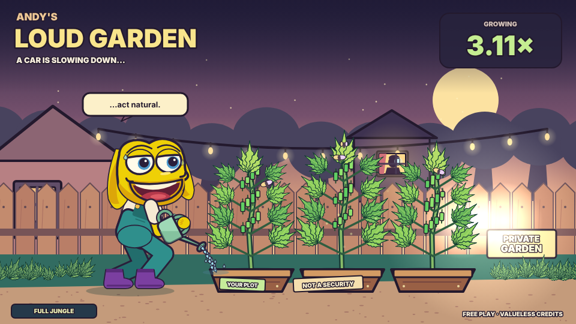
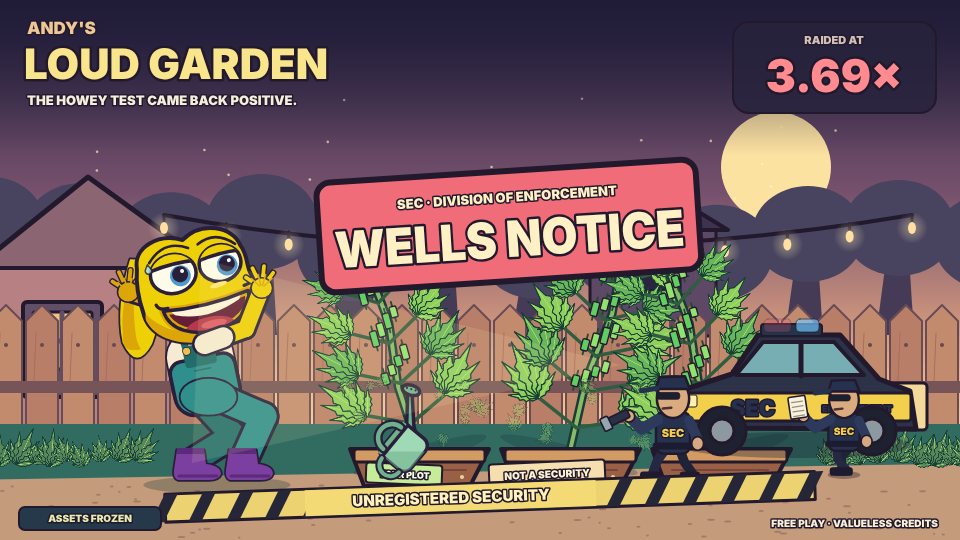

# Andy's Loud Garden

Andy grows a very conspicuous ganja garden behind his house, and it is definitely not a security. The patch grows with the room's displayed multiplier, from little seedlings to a leafy jungle whose buds bloom into **$ANDY** green candles. His broad yellow face, long hanging ears, heavy blue eyes and wide grin follow the Andy reference linked below. The character stays fully drawn in Canvas: fixed-length arms and legs, grounded feet, a yielding pelvis, and separate springs for his head, lids and ears. Both hands follow the same watering can, the far one reaching behind his body to support it from beneath; the water arcs from the rose into the soil. He breathes and shifts his weight while he waits, pours faster and sweats as the garden gets louder, and glances over his shoulder at the street.

The trouble builds with the multiplier, never with the outcome: the neighbour's window lights up at 1.6×, she is on the phone at 1.8×, headlights sweep the fence at 2× and again at 3× (that car slows and holds before moving on), a siren colours the clouds at 2.5×, and from 5.5× a drone crosses with a searchlight. Andy freezes mid-pour, ducks and mutters "act natural" at each scare; he is nervous from about 1.6× and panicking by 3×. Past 4.9× the jungle keeps climbing over the fence and the camera pulls back. At the crash, a frozen beat with a punch-in and a red-and-blue wash, then he drops the can, jumps with both feet and throws his hands up; an SEC car pulls up, a **WELLS NOTICE** slams down, two agents walk in on planted feet, leaves scatter and **UNREGISTERED SECURITY** tape closes the garden, all within about 1.4 seconds. The crash scene dissolves into the next betting phase.

An accepted cashout jeets the harvest: Andy drops the can, lowers the shades, takes a harvest basket and turns for home with alternating planted feet, lifted steps and a stride that follows his speed. The exit is timed from the round's own clock, so a late or replayed view puts him in the same place. The garden keeps growing behind him, with a gentle regret ladder in the caption, and if the round then crashes the agents find **NOBODY HOME**. A player's bed carries a **YOUR PLOT** tag; spectators see none. The harvest is a visual celebration only. Credits have no monetary value, and the scene never determines or changes a crash or cashout result.





## Play and preview

From the repository root, use Node 24 and npm 11:

```sh
npm ci --include=dev --bin-links=true
npm run preview -- andys-loud-garden
```

The preview prints the replay address. Remove `?mode=replay` to join the emulator with local credits. Use **Join round**, then **Cash out**, or press **Space** while the game has focus. Embedded play uses the host's stake and credit controls. **Restart replay** repeats the verified fixture. **Sound** enables the procedural lo-fi loop, which opens up with the round's tension (1 − 1/x), a heartbeat that quickens from about 1.3× until a cashout, cues for the window, the phone, the headlights, the siren and the drone, watering cues, the cashout chime and the raid's siren; audio starts muted.

The shared shell handles waiting, betting, running, crash, reconnect and replay. The scene reads only its `SceneView`; plant size is a visual response to the supplied multiplier, and the rig only presents what the round already decided. A round met late (a hidden tab, a page opened mid-round) settles the rig straight into its pose. The published game uses full animation regardless of browser motion preferences.

`npm run build` writes the publishable HTML, JavaScript and CSS to `dist/andys-loud-garden/`. Validate with `npm run typecheck`, `npm run check` and `npm test`. The contribution slug and replay game ID are both `andys-loud-garden`; `gallery.json` registers this game independently of Balloon Pump.

For the character's contact and motion regressions, run:

```sh
node --test games/andys-loud-garden/andy.test.mjs
```

These checks cover fixed bone lengths, the supporting palm, planted feet through acceleration and turning at 30/60/120 fps and through a scare at 30/60/144 fps, the agents' planted gait, crash hit-stop and the hop, can collision, explicit scene motion options, recovery for the next round, and the far arm's paint order: the whole arm stays behind the body, through every watering act, and only when he is caught does its forearm rise in front of the ear and behind the skull. The test file is excluded from the published bundle and source pack.

## Source and artwork

- `scene.ts` composes the backyard, the growth stages, the threat beats, the camera, Andy's drive (idle, watering, harvest, busted), the water stream, captions and audio cues.
- `andy.ts` is Andy: the rig state and its springs, the pose solver, the mode changes (the can leaving his hand, the startled hop, the turn for home), the face with its moods, the can, the basket and the water stream.
- `motion.ts` is the motion toolkit shared with the other rigged references: exact damped springs, easing and deterministic noise.
- `drawing.ts` supplies Canvas 2D shapes and serrated leaves.
- `garden.ts` draws the dusk backyard, the neighbour's window, plants, raised beds and scattered leaves.
- `police.ts` draws the SEC car, the agents and their distance-driven gait, the flashlight and closure tape, and the headlights, siren glow and drone that come before.
- `main.ts`, `audio.ts` and the base styles are the canonical Game Lab shell. All music and effects are synthesized by its audio engine; there are no recorded clips. The rig's events (a pour starting, the can hitting the ground, a footfall) cue the effects.
- `replay.json` uses the repository's verified example round with this game's ID.

Everything on the page is drawn in code; the game ships no images and makes no artwork requests. Andy is a character from Matt Furie's **Boys Club**; the rig's look (lemon yellow, hanging ears, heavy-lidded blue eyes, a broad cheek and grin, teal overalls over a cream T-shirt, purple boots) references the [Andy project website](https://boysclubandy.com/). No affiliation with or endorsement by the character's creator or the Andy project is implied.

The gallery's `open` setting permits Game Lab remixing with no derivative royalty. Character rights remain with their respective owners.

## Visual direction and small screens

The scene introduces physical presentation acts at 32, 52, 75, 100, 125 and 145 seconds (an agent at the fence, support stakes, a mist, a leaning branch), followed by bounded recurring acts for unusually long rounds. Each act's breather pauses Andy's watering so he can stare at the street; it never eases the tension or his fear. Act props fade in and out between acts and fade away at a crash or cashout. `acts.ts` reads elapsed time only; it cannot choose an outcome or promise that a round will last this long.

On narrow screens, `portrait.ts` presents a closer view of Andy and the first bed; the crash framing keeps his reaction visible alongside the arriving agents. A small overview preserves the whole garden, with readable scene text beneath it. The canonical shell still owns controls, round state and accepted cashouts.
